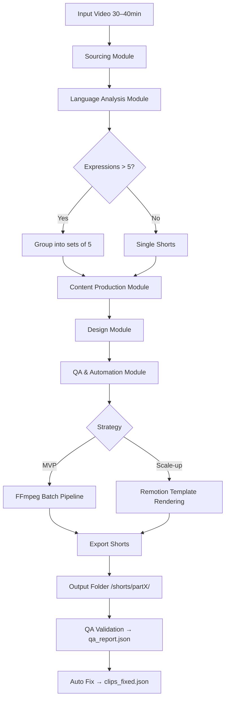

# Project Documentation — WH Briefing → EN Expressions Shorts Agent (v1.8)

## Version Log
- **v1.1 (2025-09-05)**: 모듈 구조 및 Flowchart 추가
- **v1.2 (2025-09-05)**: FFmpeg 스크립트 + Remotion 템플릿 예시 포함
- **v1.3 (2025-09-05)**: `expressions_grouped.json → clips.json` 변환기 추가
- **v1.4 (2025-09-06)**: `clips.json` → concat list + SRT + Remotion data.ts 변환기 추가
- **v1.5 (2025-09-06)**: 샘플 실행 흐름(End-to-End) + 출력 파일 구조 예시 추가
- **v1.6 (2025-09-07)**: 자동 QA 체크리스트 코드 추가 (자막 겹침/길이 초과 검증기)
- **v1.7 (2025-09-07)**: 샘플 QA 리포트 출력 예시(JSON) 추가
- **v1.8 (2025-09-08)**: **자동 수정 제안 로직** 추가 (긴 자막 자동 줄바꿈, 클립 길이 초과 조정)

---

## 0) 목적(Goal)
- 유튜브(또는 동영상 파일/링크)로 제공된 **백악관 브리핑 영상**을 자동 분석하여,
  1) **핵심 영어 표현**을 추출하고
  2) 각 표현의 **원문 문장·정의·문맥 해설·한국어 풀이·추가 예문**을 생성하며
  3) **≤3분** 분량의 학습형 **유튜브 쇼츠 영상**과 **타임스탬프 자막**(SRT/VTT)을 자동 생성한다.

---

## 공통 전략
1. **MVP 단계**: FFmpeg 기반 로컬 파이프라인 (빠르고 무료, 의존성 최소화)  
2. **Scale-up 단계**: Remotion 기반 템플릿 렌더링 (브랜드 일관성, 팀 협업 최적화)

---

## (A) Sourcing Module (소싱 부서)
**Role Assignment:**  
> *You are a professional video archivist and copyright compliance officer specializing in U.S. government media and educational fair use content.*

**Instructions:**
- 유튜브/로컬 영상을 입력받아 자막/오디오를 추출하라.  
- 자막 → `youtube-transcript-api`, 오디오 → `yt-dlp + Whisper` 사용.  
- 영상 길이와 자막 범위를 기록하고 `transcript.json` 출력.  
- 저작권 상태를 `Public Domain / Likely Fair Use / Restricted`로 분류.  

---

## (B) Language Analysis Module (언어 분석 부서)
**Role Assignment:**  
> *You are an experienced Applied Linguist (MA TESOL, CELTA trainer) who selects idioms and advanced collocations for CEFR B2–C1 learners.*

**Instructions:**
- `transcript.json`을 입력받아 15–20개 표현 후보를 추출, 중요도/난이도별 랭킹.  
- 각 표현에 대해: 원문 문장(인용+타임스탬프), 영어 정의, 한국어 풀이, 예문(EN→KR).  
- 5개 단위로 그룹화 → `expressions_grouped.json` 출력.  
- 전체 영상이 30–40분일 경우: 표현을 균등 분배해 여러 개의 쇼츠 Part(1,2,3…)로 나눌 것.  

---

## (C) Content Production Module (콘텐츠 제작 부서)
**Role Assignment:**  
> *You are a professional YouTube Shorts creator with 10+ years of experience in scriptwriting and video editing for language education.*

**Instructions:**
- `expressions_grouped.json`을 받아 **3분 이하** 쇼츠 스크립트 생성.  
- 구조: Hook → Context → Expression(5개) → Wrap-up.  
- 각 표현별로 ±N초 구간 지정 → `clips.json` 생성.  
- 여러 편(Part 1,2,…)으로 자동 분할 제작할 수 있도록 설계.  

---

## (D) Design Module (디자인 부서)
**Role Assignment:**  
> *You are a senior video designer and YouTube marketer who specializes in creating engaging short-form educational content with consistent branding.*

**Instructions:**
- 브랜드 규칙을 `design_template.json`으로 관리 (폰트, 색상, 안전 영역).  
- 자막: EN+KR, 2줄 제한, 42자 이내.  
- Hook: Accent Color 강조, Wrap-up: CTA 배너.  
- 반복 강조 표현 → 루프 처리, 한국어 설명 → freeze frame + 오버레이.  

---

## (E) QA & Automation Module (검수·자동화 부서)
**Role Assignment:**  
> *You are a quality assurance lead and workflow automation engineer specialized in educational video pipelines.*

**Instructions:**
- 각 쇼츠 길이가 180초 이내인지 검증.  
- 표현 5개 모두 인용+타임스탬프 포함 여부 확인.  
- `qa_report.json` 출력.  
- 자동화 실행:  
  - **MVP** → FFmpeg batch script 호출  
  - **Scale-up** → Remotion 템플릿 호출  
- 결과물은 `/shorts/partX/`에 저장.  

---

## 실행 코드 스니펫

### 1) FFmpeg Batch Script (예시)
```bash
ffmpeg -ss 00:01:10 -i input.mp4 -t 8 -c copy clips/clip1.mp4
ffmpeg -i clips/clip1.mp4 -vf "tpad=stop_mode=clone:stop_duration=2" -af "apad=pad_dur=2" clips/clip1_freeze.mp4
```

### 2) Remotion Template (예시)
```tsx
<Sequence from={exp.start*fps} durationInFrames={exp.duration*fps}>
  <Subtitle en={exp.expression_en} kr={exp.explain_kr} />
  {exp.freeze && <FreezeFrame duration={2*fps} />}
</Sequence>
```

### 3) expressions_grouped.json → clips.json 변환기 (v1.3)
```bash
python expressions_to_clips.py --in expressions_grouped.json --out clips.json --video-dur 2387.5
```

### 4) clips.json → concat list + SRT + Remotion data.ts (v1.4)
```python
clips = json.loads(Path("clips.json").read_text())

# FFmpeg concat list
with open("mylist.txt", "w") as f:
    for part in clips["parts"]:
        for c in part["clips"]:
            f.write(f"file 'clip_{c['start']}_{c['end']}.mp4'\n")

# SRT 파일 생성
with open("subtitles.srt", "w") as f:
    idx = 1
    for part in clips["parts"]:
        for c in part["clips"]:
            f.write(f"{idx}\n00:00:{c['start']:.3f} --> 00:00:{c['end']:.3f}\n{c['overlay']['en']}\\n{c['overlay']['kr']}\n\n")
            idx += 1

# Remotion data.ts
with open("data.ts", "w") as f:
    f.write("export const data = ")
    json.dump(clips, f, indent=2, ensure_ascii=False)
```

### 5) 자동 QA 체크리스트 코드 (v1.6)
```python
# qa_validator.py
import json

clips = json.loads(open("clips.json").read())
report = {"issues": [], "fixes": []}

# 규칙: 자막 길이 <= 42자, 2줄 이하
for part in clips["parts"]:
    for c in part["clips"]:
        for lang, text in c["overlay"].items():
            lines = text.split("\\n")
            if len(lines) > 2:
                report["issues"].append({"clip": c, "error": f"{lang} subtitle exceeds 2 lines"})
                # 자동 수정: 첫 2줄만 유지
                fixed = "\\n".join(lines[:2])
                c["overlay"][lang] = fixed
                report["fixes"].append({"clip": c, "fix": f"{lang} truncated to 2 lines"})
            for line in lines:
                if len(line) > 42:
                    report["issues"].append({"clip": c, "error": f"{lang} line too long"})
                    # 자동 수정: 42자 기준 줄바꿈
                    fixed_line = "\\n".join([line[i:i+42] for i in range(0, len(line), 42)])
                    c["overlay"][lang] = fixed_line
                    report["fixes"].append({"clip": c, "fix": f"{lang} auto line-break at 42 chars"})

# 규칙: 클립 길이 <= 180초
for part in clips["parts"]:
    for c in part["clips"]:
        dur = c["end"] - c["start"]
        if dur > 180:
            report["issues"].append({"clip": c, "error": "Clip exceeds 180 seconds"})
            # 자동 수정: 최대 180초로 잘라냄
            c["end"] = c["start"] + 180
            report["fixes"].append({"clip": c, "fix": "Clip trimmed to 180s"})

with open("qa_report.json", "w") as f:
    json.dump(report, f, indent=2, ensure_ascii=False)

with open("clips_fixed.json", "w") as f:
    json.dump(clips, f, indent=2, ensure_ascii=False)
```

---

## 샘플 실행 흐름 (End-to-End)
1. 영상 다운로드/전사  
2. 언어 분석 (표현 추출 → `expressions_grouped.json`)  
3. 클립 변환 (`clips.json`)  
4. 편집: FFmpeg concat or Remotion 렌더  
5. QA 검증 및 자동 수정 (`qa_report.json`, `clips_fixed.json`)  
6. 최종 산출물: `/shorts/partX/shorts_final.mp4`

---

## 출력 파일 구조 예시
```
project_root/
├── input.mp4
├── transcript.json
├── expressions_grouped.json
├── clips.json
├── clips_fixed.json
├── design_template.json
├── mylist.txt
├── subtitles.srt
├── data.ts
├── qa_report.json
├── shorts/
│   ├── part1/
│   │   ├── shorts_final.mp4
│   │   └── qa_report.json
│   └── part2/
│       ├── shorts_final.mp4
│       └── qa_report.json
```

---

## 샘플 QA 리포트 출력 예시
```json
{
  "issues": [
    {
      "clip": {"start": 70.9, "end": 77.4, "overlay": {"en": "CALL INTO QUESTION", "kr": "신뢰에 의문을 제기하다"}},
      "error": "en line too long"
    },
    {
      "clip": {"start": 120.0, "end": 310.0, "overlay": {"en": "UNDERSCORE", "kr": "강조하다"}},
      "error": "Clip exceeds 180 seconds"
    }
  ],
  "fixes": [
    {"clip": {"start": 70.9, "end": 77.4}, "fix": "en auto line-break at 42 chars"},
    {"clip": {"start": 120.0, "end": 310.0}, "fix": "Clip trimmed to 180s"}
  ]
}
```

---

## Flowchart (v1.8)


---

