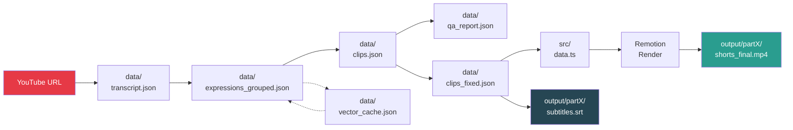
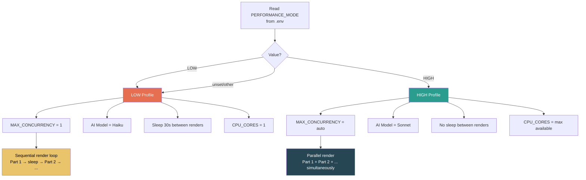
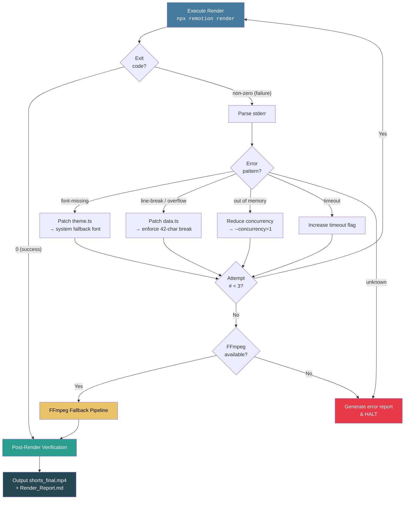

# Pipeline Flowchart

## Full System Flow

```mermaid
flowchart TD
    subgraph INPUT["INPUT"]
        YT["YouTube Briefing URL<br/>(30–40 min video)"]
        ENV[".env Configuration<br/>PERFORMANCE_MODE / SUPABASE"]
    end

    subgraph ANALYST["ANALYST AGENT"]
        direction TB
        A1["STEP 2: Fetch Transcript<br/><code>fetch_transcript.py</code>"]
        A2["yt-dlp downloads<br/>captions (VTT/SRT)"]
        A3["Clean & parse to<br/><code>data/transcript.json</code>"]
        A4["STEP 3: Extract Expressions<br/><code>extract_expressions.py</code>"]
        A5["Linguistic Analysis<br/>15–20 expressions<br/>CEFR B2–C1 ranking"]
        A6["Group into sets of 5<br/><code>data/expressions_grouped.json</code>"]
        A7["Cross-Briefing RAG<br/>Supabase pgvector"]
        A1 --> A2 --> A3 --> A4 --> A5 --> A6
        A6 --> A7
    end

    subgraph DIRECTOR["DIRECTOR AGENT"]
        direction TB
        D1["STEP 4: Generate Clips<br/><code>expressions_to_clips.py</code>"]
        D2["Assign timestamps<br/>+ segment types"]
        D3["Apply caption rules<br/>2 lines / 42 chars max"]
        D4["<code>data/clips.json</code>"]
        D1 --> D2 --> D3 --> D4
    end

    subgraph QA["QA MODULE"]
        direction TB
        Q1["STEP 5: Validate<br/><code>qa_validator.py</code>"]
        Q2{"Issues<br/>found?"}
        Q3["Auto-Fix<br/>line-break / trim"]
        Q4["<code>data/clips_fixed.json</code><br/><code>data/qa_report.json</code>"]
        Q1 --> Q2
        Q2 -- Yes --> Q3 --> Q4
        Q2 -- No --> Q4
    end

    subgraph DIRECTOR2["DIRECTOR AGENT (Phase 2)"]
        direction TB
        D5["STEP 6: Generate data.ts<br/><code>generate_data_ts.py</code>"]
        D6["TypeScript type-check<br/><code>npm run typecheck</code>"]
        D5 --> D6
    end

    subgraph PREVIEW["PREVIEW (Optional)"]
        direction TB
        P1["STEP 7: Remotion Studio<br/><code>npm run studio</code>"]
        P2["Visual inspection<br/>in browser"]
        P1 --> P2
    end

    subgraph ENGINEER["ENGINEER AGENT"]
        direction TB
        E1["STEP 8: Render"]
        E2{"PERFORMANCE<br/>MODE?"}
        E3["LOW Profile<br/>concurrency=1<br/>sleep 30s between"]
        E4["HIGH Profile<br/>concurrency=max<br/>parallel renders"]
        E5["Remotion CLI<br/><code>npx remotion render</code>"]
        E6{"Render<br/>success?"}
        E7["Self-Healing Loop<br/>parse stderr<br/>auto-fix & retry"]
        E8{"Retries<br/> < 3?"}
        E9["FFmpeg Fallback<br/>(MVP mode)"]
        E1 --> E2
        E2 -- LOW --> E3 --> E5
        E2 -- HIGH --> E4 --> E5
        E5 --> E6
        E6 -- No --> E7 --> E8
        E8 -- Yes --> E5
        E8 -- No --> E9
        E6 -- Yes --> VERIFY
    end

    subgraph VERIFY["POST-RENDER VERIFICATION"]
        direction TB
        V1["STEP 9: Verify Output"]
        V2["Check file size > 0"]
        V3["Verify 1080x1920 resolution"]
        V4["Duration within ±2s"]
        V5["Generate<br/><code>Render_Report.md</code>"]
        V1 --> V2 --> V3 --> V4 --> V5
    end

    subgraph OUTPUT["OUTPUT"]
        direction TB
        O1["<code>output/partX/shorts_final.mp4</code><br/>1080x1920 @ 30fps"]
        O2["<code>output/partX/subtitles.srt</code><br/>Bilingual EN/KR"]
        O3["<code>output/partX/qa_report.json</code>"]
        O4["<code>output/partX/Render_Report.md</code>"]
    end

    YT --> A1
    ENV --> A1
    ENV --> E2
    A6 --> D1
    A7 -.->|"vector_cache.json<br/>(offline fallback)"| A6
    D4 --> Q1
    Q4 --> D5
    D6 --> P1
    D6 --> E1
    P2 -.->|"visual OK"| E1
    E9 --> VERIFY
    V5 --> O1
    V5 --> O2
    V5 --> O3
    V5 --> O4

    style INPUT fill:#1a1a2e,stroke:#e94560,color:#fff
    style ANALYST fill:#16213e,stroke:#0f3460,color:#fff
    style DIRECTOR fill:#1a1a2e,stroke:#533483,color:#fff
    style QA fill:#1a1a2e,stroke:#e94560,color:#fff
    style DIRECTOR2 fill:#1a1a2e,stroke:#533483,color:#fff
    style PREVIEW fill:#0f3460,stroke:#53a8b6,color:#fff
    style ENGINEER fill:#16213e,stroke:#e94560,color:#fff
    style VERIFY fill:#1a1a2e,stroke:#0f3460,color:#fff
    style OUTPUT fill:#0f3460,stroke:#53a8b6,color:#fff
```

---

## Agent Responsibility Map

```mermaid
flowchart LR
    subgraph ANALYST["ANALYST AGENT<br/>(Linguistic Researcher)"]
        AT1["yt-dlp"]
        AT2["Supabase/pgvector"]
        AT3["Python scripts"]
    end

    subgraph DIRECTOR["DIRECTOR AGENT<br/>(Creative Producer)"]
        DT1["Remotion Templates"]
        DT2["TypeScript codegen"]
    end

    subgraph ENGINEER["ENGINEER AGENT<br/>(Systems Engineer)"]
        ET1["Remotion CLI"]
        ET2["FFmpeg"]
        ET3["Bash"]
    end

    ANALYST -->|"expressions_grouped.json"| DIRECTOR
    DIRECTOR -->|"src/data.ts + clips.json"| ENGINEER
    ENGINEER -->|"output/partX/shorts_final.mp4"| DONE["Upload to YouTube"]

    style ANALYST fill:#2d6a4f,stroke:#40916c,color:#fff
    style DIRECTOR fill:#774936,stroke:#a68a64,color:#fff
    style ENGINEER fill:#3d405b,stroke:#81b29a,color:#fff
    style DONE fill:#e07a5f,stroke:#f2cc8f,color:#fff
```

---

## Data Flow (File-Level)

```mermaid
flowchart LR
    URL["YouTube URL"] --> T["data/<br/>transcript.json"]
    T --> EG["data/<br/>expressions_grouped.json"]
    EG --> CJ["data/<br/>clips.json"]
    CJ --> QA["data/<br/>qa_report.json"]
    CJ --> CF["data/<br/>clips_fixed.json"]
    CF --> DTS["src/<br/>data.ts"]
    DTS --> RENDER["Remotion<br/>Render"]
    RENDER --> MP4["output/partX/<br/>shorts_final.mp4"]

    EG -.-> VC["data/<br/>vector_cache.json"]
    VC -.-> EG

    CF --> SRT["output/partX/<br/>subtitles.srt"]

    style URL fill:#e63946,color:#fff
    style MP4 fill:#2a9d8f,color:#fff
    style SRT fill:#264653,color:#fff
```

---

## Performance Profile Decision Tree

```mermaid
flowchart TD
    START["Read PERFORMANCE_MODE<br/>from .env"] --> CHECK{"Value?"}

    CHECK -- "LOW" --> LOW_BRANCH["LOW Profile"]
    CHECK -- "HIGH" --> HIGH_BRANCH["HIGH Profile"]
    CHECK -- "unset/other" --> LOW_BRANCH

    LOW_BRANCH --> L1["MAX_CONCURRENCY = 1"]
    LOW_BRANCH --> L2["AI Model = Haiku"]
    LOW_BRANCH --> L3["Sleep 30s between renders"]
    LOW_BRANCH --> L4["CPU_CORES = 1"]

    HIGH_BRANCH --> H1["MAX_CONCURRENCY = auto"]
    HIGH_BRANCH --> H2["AI Model = Sonnet"]
    HIGH_BRANCH --> H3["No sleep between renders"]
    HIGH_BRANCH --> H4["CPU_CORES = max available"]

    L1 --> SEQ["Sequential render loop<br/>Part 1 → sleep → Part 2 → ..."]
    H1 --> PAR["Parallel render<br/>Part 1 + Part 2 + ... simultaneously"]

    style LOW_BRANCH fill:#e76f51,color:#fff
    style HIGH_BRANCH fill:#2a9d8f,color:#fff
    style SEQ fill:#e9c46a,color:#000
    style PAR fill:#264653,color:#fff
```

---

## Self-Healing Render Loop

```mermaid
flowchart TD
    RENDER["Execute Render<br/><code>npx remotion render</code>"] --> RESULT{"Exit<br/>code?"}

    RESULT -- "0 (success)" --> VERIFY["Post-Render Verification"]
    RESULT -- "non-zero (failure)" --> PARSE["Parse stderr"]

    PARSE --> MATCH{"Error<br/>pattern?"}

    MATCH -- "font-missing" --> FIX_FONT["Patch theme.ts<br/>→ system fallback font"]
    MATCH -- "line-break / overflow" --> FIX_LINE["Patch data.ts<br/>→ enforce 42-char break"]
    MATCH -- "out of memory" --> FIX_MEM["Reduce concurrency<br/>→ --concurrency=1"]
    MATCH -- "timeout" --> FIX_TIME["Increase timeout flag"]
    MATCH -- "unknown" --> REPORT["Generate error report<br/>& HALT"]

    FIX_FONT --> RETRY{"Attempt<br/># < 3?"}
    FIX_LINE --> RETRY
    FIX_MEM --> RETRY
    FIX_TIME --> RETRY

    RETRY -- "Yes" --> RENDER
    RETRY -- "No" --> FALLBACK{"FFmpeg<br/>available?"}

    FALLBACK -- "Yes" --> FFMPEG["FFmpeg Fallback Pipeline"]
    FALLBACK -- "No" --> REPORT

    FFMPEG --> VERIFY
    VERIFY --> DONE["Output shorts_final.mp4<br/>+ Render_Report.md"]

    style RENDER fill:#457b9d,color:#fff
    style VERIFY fill:#2a9d8f,color:#fff
    style REPORT fill:#e63946,color:#fff
    style FFMPEG fill:#e9c46a,color:#000
    style DONE fill:#264653,color:#fff
```
